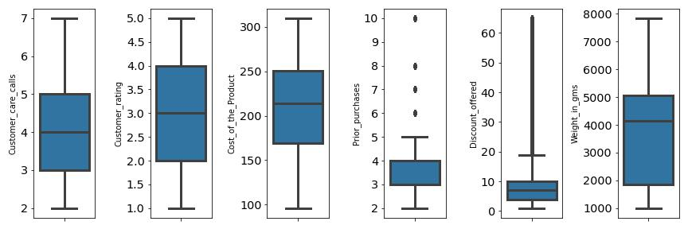
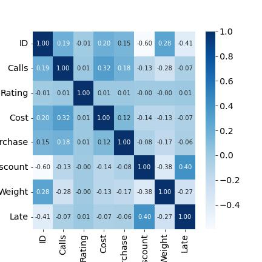
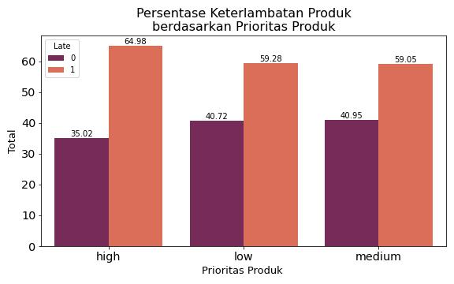
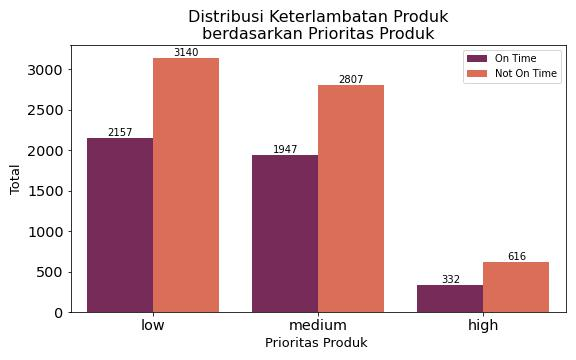
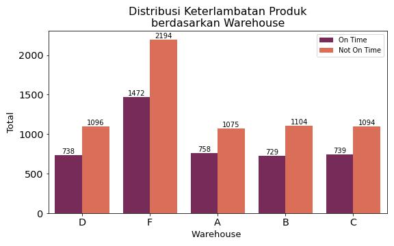
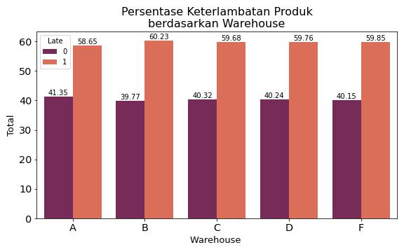
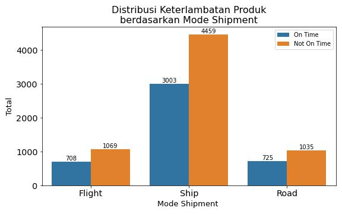
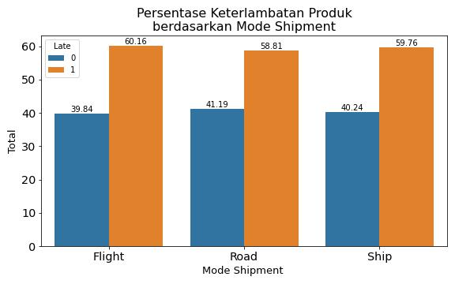

# E-commerce Shipping Problem
Pada project ini akan dilakukan prediksi keterlambatan pengiriman produk suatu e-commerce dengan data yang bersumber dari [kaggle.](https://www.kaggle.com/code/paulbacher/e-commerce-shipping-data-eda/data)

## Stage 1 : Exploratory Data Analysis
Pada stage ini akan dilakukan exploratory data analysis dari data e-commerce shipping.

- **Descriptive Statistics** \
Data terdiri dari 10.999 row, 11 kolom feature dan 1 kolom target. 
Dari data mean, median, dan modus data numerik diperoleh bahwa kolom discount_offered **positively skewed distribution**. Selanjutnya, diperoleh bahwa barang **yang mengalami keterlambatan lebih banyak** daripada yang datang tepat waktu.  

- **Distribution of Data** \

Kolom Prior_purchases dan Discount_offered memiliki **outlier**. 

- **Korelasi antar Feature** \
\
Tidak ada dua feature yang berkorelasi kuat. Korelasi antar feature rata-rata bersifat sedang yaitu feature `Discount_offered` dengan `Weight`(korelasi negatif) dan feature `Cost_of_the_Product` dengan `Customer_care_calls` (korelasi positif).

- **Korelasi Feature dengan Target**
\
Feature `Discount_offered` dengan `Late` memiliki nilai korelasi sebesar 0.40 bersifat positif.\
Feature `Weight` dengan `Late` memiliki nilai korelasi sebesar 0.27 bersifat negatif.

- **Business Insight**

**1. Product Importance**

 \
Barang dengan **prioritas tinggi(high)** memiliki tingkat keterlambatan paling tinggi yakni 64% dari masing-masing tingkat prioritas barang. 

**2. Warehouse**

\
**Warehouse F** mengirim barang paling banyak, dan juga memiliki keterlambatan barang paling banyak. Namun secara persentase, **warehouse B** memiliki tingkat keterlambatan paling tinggi yaitu 60,23 %. Perhatikan gambar berikut.

**3. Shipment**

\
Hanya sekitar 40% dari semua pesanan terkirim tepat waktu untuk setiap mode pengiriman. Pengiriman dengan tingkat keterlambatan tertinggi yakni flight dengan 60%.\
Cara transportasi pesanan yang dominan adalah dengan kapal laut yang mencapai sekitar 7.200 pesanan, dan selebihnya merata antara opsi flight dan road.
